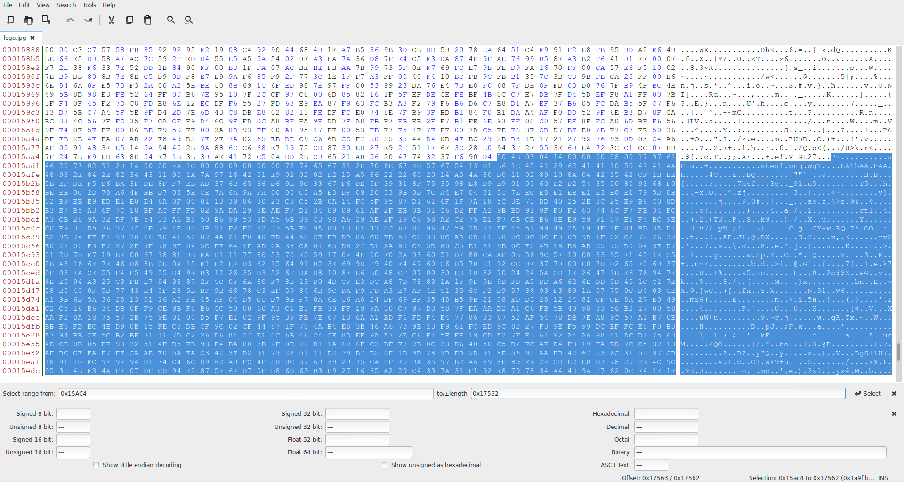
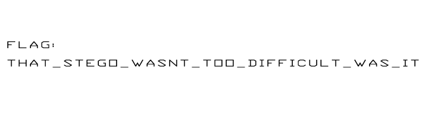

# CTCTF 2015: Capture the Logo

### Problem

**Points**: 45

**Description**: 


**Hint**: 

> Hint

### Solution

This JPG file can be scanned for additional hidden files by using the [`binwalk`](http://binwalk.org/) utility.

```
[!] binwalk logo.jpg

DECIMAL     HEX         DESCRIPTION
-------------------------------------------------------------------------------------------------------
12          0xC         TIFF image data, big-endian
205         0xCD        LZMA compressed data, properties: 0x04, dictionary size: 16777216 bytes, uncompressed size: 805371904 bytes
5351        0x14E7      LZMA compressed data, properties: 0x0C, dictionary size: 33554432 bytes, uncompressed size: 61503 bytes
88772       0x15AC4     Zip archive data, at least v2.0 to extract, compressed size: 6699, uncompressed size: 7418, name: "steg1.png"  
95587       0x17563     End of Zip archive 

```

That ZIP file looks interesting. We opened the file up in the [`Bless`](http://home.gna.org/bless/) hex editor, selected the range between `0x15AC4` and `0x17562` bytes, inclusive, and copied the selected data into a new file.



Extracting this ZIP file gave us one PNG file named `steg1.png`, which contains the flag.



**Flag**: `that_stego_wasnt_too_difficult_was_it`

### Other Resources

* None.
