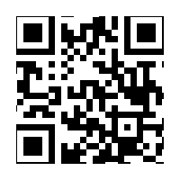

# CTCTF 2015: Faulty QR

### Problem

**Points**: 30

**Description**: 



**Hint**: 

```
What do you know about QR codes?
```

### Solution

QR codes are two-dimensional matrices that hold information much like barcodes do. The edges of this QR code have been cropped off, making it impossible for a device to scan it. Our own human brains, however, can extrapolate from the data on the edge of the image to detect the colors of the squares that should exist there.

Although there are probably more clever solutions, the image was small enough that we were able to reconstruct the below QR code using [GIMP](http://www.gimp.org/) and to scan it to get the flag.


**Flag**: `QRsAreTooEasyToFix`

### Other Resources

* [ISO/IEC 18004](https://www.iso.org/obp/ui/#iso:std:iso-iec:18004:ed-3:v1:en), the technical specifications of QR codes
