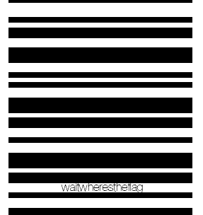
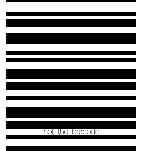

# CTCTF 2015: Patience

### Problem

**Points**: 35

**Description**: 



**Hint**: 

```
Sometimes the obvious isn't the answer
```

### Solution

One's first instinct would be to scan this barcode. However, this image is a GIF (Graphics Interchange Format), which means that it can handle animation. The program displaying the GIF would draw several, successive still frames to create the illusion of motion. We used [this tool](http://ezgif.com/split) to separate this GIF into its frames. At the very end is the 100th frame, which contains the flag: 



**Flag**: `not_the_barcode`

### Other Resources

* None.
