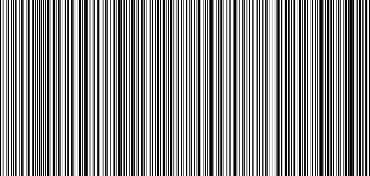

# CTCTF 2015: Uninteresting gif

### Problem

**Points**: 60

**Description**: 


**Hint**: 

> Hint

### Solution

Seems like a plain black GIF with some random noise in it, right? Nope. At the very bottom is what appears to be a fragment of a barcode. We split the GIF into its frames using [this tool](http://ezgif.com/split), then converted the first frame into the [PPM image format](http://en.wikipedia.org/wiki/Netpbm_format), which lists its colors values in ASCII and for which I had already written [a library](imagelib.py). Then, we ran [this program](solution.py) on it, converted `tmp.ppm` into PNG, and then scanned it using [this](http://online-barcode-reader.inliteresearch.com/).

```
[!] convert -compress None frames/frame_000.gif barcode.ppm
[!] python3 solution.py 
Reading image from barcode.ppm . . . 
Image dimensions: 300 x 629 pixels
Writing image to tmp.ppm . . . 
[!] convert tmp.ppm tmp.png
```

Here was the original barcode: 



Note: beware of mixing up which stripes were black and white, which we did initially.

**Flag**: `useless_fact_the_1st_barcode_scanned_was_for_gum`

### Other Resources

* None.
